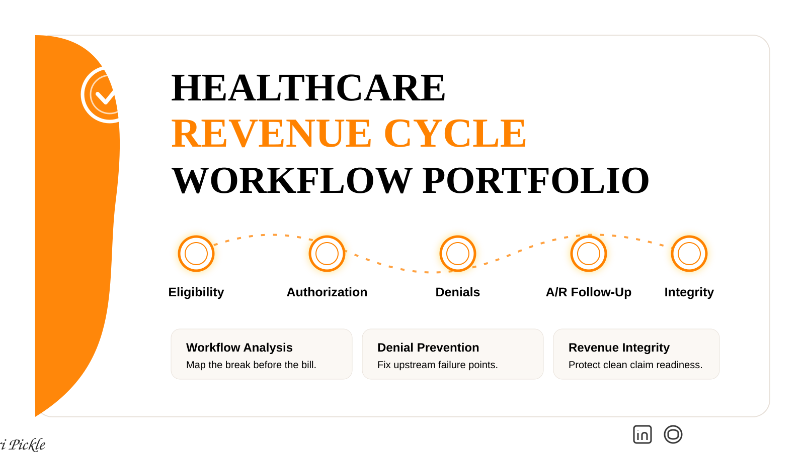

<div align="center">



</div>

# Healthcare Revenue Cycle Workflow Portfolio

**RCM Workflow Analysis | Denial Prevention | Claims Accuracy | Healthcare Operations**

This portfolio showcases practical healthcare revenue cycle workflow analysis with a focus on identifying upstream workflow breakdowns that lead to claim denials, rework, delays, A/R issues, and revenue loss.

The goal is to demonstrate real-world understanding of how administrative workflows impact financial performance, patient access outcomes, and operational reliability.

---

## Brand Identity

| Brand Role | Color | Hex Code | Use |
|---|---|---:|---|
| Primary Background | White | `#FFFFFF` | Main backgrounds, case study pages, portfolio visuals, documentation space |
| Accent Color | Tennessee Orange | `#FF8200` | Headings, section dividers, workflow nodes, callouts, metrics, emphasis labels |
| Font Color | Black | `#000000` | Main body text, titles, labels, workflow steps, table content |

## Visual Direction

This portfolio follows a premium healthcare operations identity:

- High-contrast editorial serif headline style
- Clean sans-serif supporting text
- Tennessee Orange `#FF8200` accent system
- White `#FFFFFF` background with warm gray structure
- Double-ring circular workflow nodes with soft glow
- Dotted or fading connector lines
- Structured grid with intentional asymmetry
- 40–50% whitespace for breathing room

---

## Core Analyst Insight

> Most revenue cycle problems do not begin in billing. They begin upstream in intake, documentation, eligibility verification, authorization tracking, and handoff reliability.

---

## Core Focus Areas

| Focus Area | Why It Matters |
|---|---|
| Insurance Verification and Eligibility Accuracy | Prevents inactive coverage denials, payer mismatches, and patient billing confusion |
| Workflow Mapping and Process Optimization | Shows where handoffs, delays, duplicate work, and rework enter the process |
| Denial Root-Cause Identification and Prevention | Connects denials back to the upstream workflow failure that created them |
| Claims Accuracy and Documentation Integrity | Supports clean claim readiness and reduces preventable rework |
| Patient Access and Financial Experience | Improves scheduling, communication, clearance, and patient trust |

---

## What You’ll Find Here

- Realistic RCM workflow breakdowns
- Root-cause analysis of denials and delays
- Eligibility verification and patient access examples
- Prior authorization workflow mapping
- A/R follow-up prioritization examples
- Operational checklists and templates
- Metrics and KPI tracking examples
- Visual workflow maps and diagrams

---

## Portfolio Projects

### 01 — Denial Root-Cause Workflow

Analyzes how upstream intake, eligibility, authorization, documentation, and handoff problems can lead to claim denials. The purpose is to identify the operational cause instead of only reacting to the denial after it reaches billing.

**Skills shown:** denial category analysis, root-cause thinking, upstream versus downstream impact mapping, workflow breakdown identification, prevention recommendations.

### 02 — Eligibility Verification Breakdown

Breaks down eligibility verification as a front-end revenue cycle checkpoint and shows how insurance accuracy, payer rules, coordination of benefits, and patient access checkpoints help prevent downstream claim issues.

**Skills shown:** patient access workflow analysis, insurance verification logic, data accuracy review, payer rule awareness, preventable denial risk identification.

### 03 — Prior Authorization Workflow Map

Maps prior authorization steps and highlights delay points that affect patient access, scheduling, reimbursement, clinical documentation, and staff workload.

**Skills shown:** authorization process mapping, delay-risk analysis, handoff evaluation, documentation dependency review, workflow improvement planning.

### 04 — A/R Follow-Up Prioritization

Demonstrates how accounts receivable follow-up can be prioritized using aging, balance, payer type, denial status, and action urgency.

**Skills shown:** A/R aging review, queue prioritization, financial-impact thinking, operational triage, revenue cycle workload management.

---

## Repository Structure

```text
remote-revenue-cycle-analyst-portfolio/

README.md
LICENSE
BRAND-GUIDE.md

assets/
  portfolio-visual-identity.svg

01-denial-root-cause-workflow/
  denial-root-cause-analysis.md
  denial-categories-table.csv
  denial-workflow-map.md

02-eligibility-verification-breakdown/
  eligibility-verification-breakdown.md
  eligibility-checklist.csv
  workflow-failure-points.md

03-prior-authorization-workflow-map/
  prior-auth-workflow-map.md
  prior-auth-delay-risk-table.csv
  prior-auth-process-map.md

04-ar-follow-up-prioritization/
  ar-follow-up-prioritization-example.md
  ar-aging-prioritization-table.csv
  follow-up-queue-framework.md

05-resume-linkedin/
  resume-bullet-examples.md
  linkedin-featured-section-copy.md
```

---

## Target Roles

This portfolio is built for roles such as:

- Remote Revenue Cycle Analyst
- Revenue Integrity Analyst
- Denial Management Analyst
- Prior Authorization Analyst
- Healthcare Operations Analyst
- Patient Access Analyst
- A/R Follow-Up Analyst

---

## Tools Used

- GitHub for portfolio documentation
- Markdown for case study writeups
- CSV files for sample workflow tables
- Google Sheets or Excel for data organization
- Canva or similar tools for public-facing visual summaries

---

## Data and Privacy Disclaimer

All examples in this repository use fictional, synthetic, or publicly available data. No protected health information, patient records, payer account details, claim numbers, authorization numbers, employee names, screenshots from private systems, or confidential organizational data are included.

---

## Created By

**Created by Kori Pickle**

*Kori Pickle*

LinkedIn | GitHub

BSHA Student, University of Phoenix  
Healthcare Administration | Revenue Cycle | Workflow Analysis | Healthcare Operations
